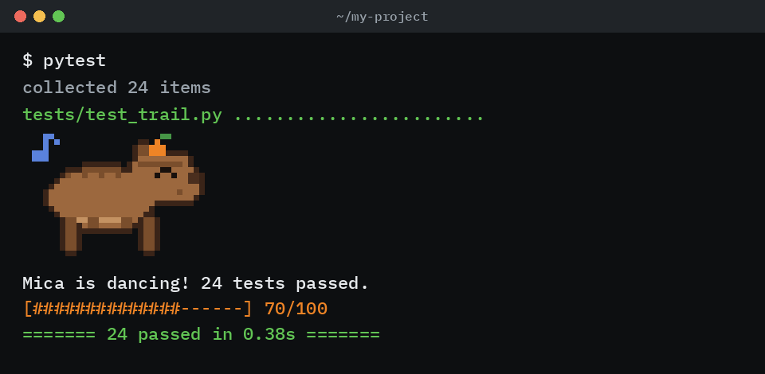
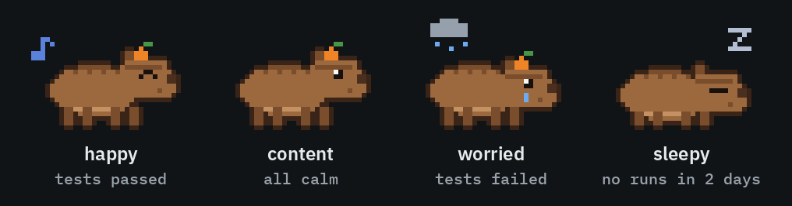

<p align="center"></p>

# Micapybara

A pixel capybara who lives in your terminal. She dances when your tests pass.

Her name is Mica. After every `pytest` run she reads the results and reacts. Green tests make her dance, red ones make her worried, and if you don't run your tests for a couple of days, she falls asleep. A personal project in Python, pytest and Pydantic.

**[Try her in your browser](https://jordanaftali.github.io/micapybara)**: run passing or failing tests, feed her an orange, or skip a few days.

<p align="center"></p>

## Adopt Mica

```bash
pip install git+https://github.com/jordanaftali/micapybara
pytest                      # she shows up after every run
```

That's it. The pytest plugin installs with the package, so there is nothing to configure.

## Her moods

<p align="center"></p>

| What happens | Happiness | Streak |
| --- | --- | --- |
| All tests pass | +10 | +1 |
| Any test fails | −15 | back to 0 |
| You feed her an orange (`capy feed`, once an hour) | +5 | |
| A day goes by without a visit | −5 | |

She's **happy** at 70 or more, **content** below that, **worried** after a red run, and **sleepy** after 2 days without tests.

## The `capy` command

```bash
capy              # how is she doing?
capy feed         # give her an orange
capy dance        # because why not
capy name Bia     # rename her (1 to 20 characters)
capy stats        # runs, streaks, oranges
capy reset        # start over
```

## Turning her off

- `pytest --no-capy` hides her for one run
- `MICAPYBARA_QUIET=1` hides her always
- `NO_COLOR=1` draws her in plain blocks, no colors
- In CI she shows a single still frame instead of dancing

She never changes your test results or exit code. If anything goes wrong inside the plugin, she quietly skips that run.

## How it's built

- **She is drawn in Python.** `sprite.py` builds each frame as a 34 × 26 grid of colored pixels: an ellipse for the body, a boxy snout, an orange on her head and an outline traced around her. The same grid becomes the terminal art, the GIF, the demo page and the link preview.
- **Two pixels per character.** `render.py` prints each terminal cell as an upper half block (`▀`) with a truecolor foreground and background, so she fits in 34 columns and 13 lines.
- **A pytest plugin.** `plugin.py` uses the `pytest_terminal_summary` hook and registers through the `pytest11` entry point, so installing the package is enough.
- **Pydantic keeps her state valid.** Her save file (`~/.micapybara/state.json`, or the folder in `MICAPYBARA_HOME`) is loaded into a Pydantic model. Happiness must stay between 0 and 100, names must be 1 to 20 printable characters, and a broken or hand-edited file gives you a fresh capybara instead of a crash.

## Tests

```bash
pip install -e ".[dev]"
pytest
```

24 tests, including real pytest sessions run inside the tests with `pytester`. They check that she dances on green runs, worries on red ones, never changes the exit code, respects `--no-capy` and `MICAPYBARA_QUIET`, and survives a broken save file.

## Project layout

| Path | What it is |
| --- | --- |
| `src/micapybara/sprite.py` | Mica's pixel art and every mood's frames |
| `src/micapybara/render.py` | Prints a sprite with truecolor half blocks |
| `src/micapybara/state.py` | Her saved state as a Pydantic model, and the rules |
| `src/micapybara/plugin.py` | The pytest plugin |
| `src/micapybara/cli.py` | The `capy` command |
| `src/micapybara/messages.py` | Everything she says |
| `docs/` | The live demo and all images |
| `art/make_images.py` | Builds every image in `docs/` from the sprite |

## Why I built this

I wanted a small, fun project that still uses real tools well: a pytest plugin with tests that run pytest, Pydantic for data you can trust, and pixel art drawn entirely in code. Tests are more fun to run when someone cheers for you.

## License

MIT. Mica is original pixel art, drawn in code by Jordana Naftali.
